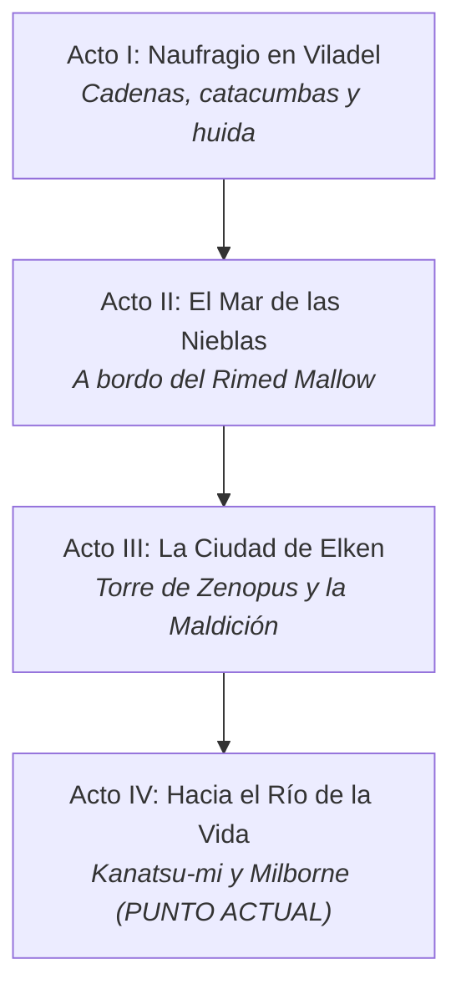

# 🔨 Guía de Reincorporación para Kazrim (Kazgrim Iwakura)
### *De las Catacumbas de Viladel a la Forja de Kagutsuchi*

> [!IMPORTANT]
> **Tu Identidad en la Mesa:**
> Eres **Kazgrim Iwakura (Kaz)**, cantero enano de 38 años procedente de las montañas del norte (*Kizuna-no-Miya*). Eres el **Clérigo de Kagutsuchi** (dios primordial del fuego, la forja y la piedra volcánica). La piedra te habla, tu martillo moldea el mundo y tu fe en la llama renaciente ha salvado ya dos veces la vida del grupo.

---

## 🌟 1. Tus Grandes Hitos: Lo que tú hiciste por el grupo
Aunque hayas estado ausente en varias sesiones ("rezando en silencio o en comunión con la piedra"), tu presencia en los momentos críticos ha sido legendaria:

1. **El Milagro de la Luz en el Oubliette (Sesión IV):**
   Cuando el grupo cayó en un pozo ciego bajo las catacumbas de Viladel, heridos, a oscuras y oyendo patrullas orcas arriba, tú te arrodillaste en el fango y canalizaste una esfera de luz divina azul crepitante que desterró la tiniebla y permitió a todos escapar de las trampas.
2. **La Salvación de Hiroyuki (Sesión IV):**
   En el muelle subterráneo, mientras huíais en el barco del heredero y los orcos derribaban a Hiroyuki a balazos, invocaste el fuego de Kagutsuchi para sellar sus heridas en el último suspiro.
3. **La Apertura del Templo del Río (Sesión XIV):**
   Tras un largo viaje en silencio, colocaste tu símbolo sagrado en la ranura ancestral del monolito de la montaña, haciendo retumbar la roca y abriendo el santuario que conducía a *Kanatsu-mi*.

---

## 📜 2. Resumen Exprés de la Campaña: ¿Qué ha pasado?



### Acto I: El Naufragio y la Fuga de Viladel (Sesiones 1 a 4)
* Despertasteis encadenados en una playa tras el cataclismo que destruyó vuestra tierra natal (**Amatsukuni**).
* Os abristeis paso entre trasgos, explorasteis la mansión de Viladel y fuisteis traicionados por el chambelán **Keestake**.
* Escapasteis bajo tierra en la **Galera del Príncipe** justo antes de que 12 tornados sobrenaturales hundieran la isla entera en el océano.

### Acto II: La Travesía Oceánica (Sesión 5)
* Rescatados en alta mar por el navío *Rimed Mallow*, capitaneado por **Mirna "La Loba"**.
* Travesía a través de las nieblas hasta alcanzar el continente de **Thir**.

### Acto III: Las Conspiraciones de Elken (Sesiones 6 a 12)
* **Los 40 Refugiados Kunitas:** Vuestro pueblo sobrevive hacinado extramuros de la ciudad de Elken bajo el recelo y la xenofobia de las autoridades locales (*Seraphine Alondar*). **Katsumi** (clériga de Shien) y **Kaito** intentan mantenerlos con vida.
* **El Secuestro de Itarus:** Noblezas aliadas fueron atacadas en la *Taberna del Ganso*. El niño **Itarus** fue secuestrado por sicarios del curtidurero **Sutter Izen** y el nigromante **Zarcand**. Hiroyuki juró rescatarlo.
* **La Torre de Zenopus & La Maldición de Glunt:** El grupo asaltó la torre abandonada del legendario archimago Zenopus. Derrotaron a los contrabandistas, pero **Glunt contrajo la Maldición de las Venas Negras**, una gangrena mágica que ascendía por su pierna y amenazaba con matarlo.
* **El Enigma de la Máscara y el Ojo:** La máscara de bronce de la torre habló tras pronunciar la palabra arcana *Anamnesis*. Descubrieron el diario de Zenopus, que indicaba que la única cura para la maldición estaba en las aguas primordiales de **Kanatsu-mi** (el Río de la Vida), en el interior montañoso.

### Acto IV: La Marcha a Milborne y la Fuente de Vida (Sesiones 13 a 16)
* El grupo remontó el curso fluvial hacia el este.
* Vencieron al oso-búho del bosque y tú abriste las puertas del templo ancestral con tu símbolo de Kagutsuchi.
* En el sanctum de Kanatsu-mi, **Glunt bebió de la fuente y la maldición de las venas negras retrocedió por completo**. ¡Glunt está curado!
* De regreso a la posada de **Milborne**, os habéis topado con secretos colosales que os ponen en marcha hacia el siguiente gran objetivo.

---

## 🔥 3. TU GRAN GANCHO PERSONAL: La Ciudadela Enana Perdida
*(Revelado al final de la Sesión XVI en la taberna de Milborne)*

En la posada conocisteis a **El Viejo Oso**, un enano anciano, tuerto y cojo:
* Les contó que de niño vivía en una **antigua ciudadela enana en las montañas**, hasta que los orcos los expulsaron.
* Años después intentó reconquistarla con un batallón de enanos y fracasó (de ahí su cojera).
* Lo crucial para ti: Describió **salones titánicos, una forja colosal que calentaba la piedra de toda la montaña**, y niveles subterráneos que los orcos nunca se atrevieron a pisar.
* Más allá, en un valle oculto, hay **escrituras sagradas idénticas a los monolitos de Kagutsuchi y a los templos de Amatsukuni**.

> [!TIP]
> **Para Kazrim:** Este templo no es solo una mina abandonada: es un **Santuario Sagrado de tu Dios**. Los kami del fuego te han guiado hasta aquí para que reclames esa forja y descubras por qué los monolitos de tu pueblo están grabados en la cordillera de Thir.

---

## 👥 4. Dramatis Personae: ¿Quién es quién?

### Tus Compañeros (Los Koonies)
* **Glunt:** El coloso bonachón. Fuerza 17. Te admira profundamente y te ve como el sabio que no tiene prisa. Acaba de salvarse de la muerte gracias a las aguas de la montaña.
* **Hiroyuki Watanabe:** El samurai kensei. Líder marcial honorable. Está obsesionado y dividido: quiere volver de inmediato a Elken para salvar al niño secuestrado (*Itarus*).
* **Sakura:** Maga kunita pragmática. Lleva ahora el **Ojo de J'karaa** al cuello y el grimorio del nigromante Zarcand. Es como una hermana para Jelenneth.
* **Ainur:** El explorador/pícaro elfo. Se ha quitado el colgante maldito para dárselo a Sakura y respirar tranquilo.

### PNJs Clave en este momento
* **Katsumi:** Clériga de Shien. Se ha quedado en Elken al frente de los 40 refugiados kunitas. (El GM la usó como sanadora de respaldo mientras tú estabas ausente).
* **El Viejo Oso:** El veterano enano en la taberna de Milborne. Tiene el mapa mental de la ciudadela enana y es tu nuevo mejor amigo.
* **Jelenneth:** Joven maga samaritana y aprendiz de Tauster. Viaja con el grupo, cura con hierbas y os ha guiado a Thurmaster.
* **Tauster:** Mago veterano de la torre de Thurmaster. Paranoico, panzudo y brillante. Les ha pedido ayuda urgente para encontrar una reliquia antes de que caiga en manos de enemigos, y quiere comprar el anillo sellador de Zenopus.

---

## 🧭 5. Estado Actual & Dilemas Inmediatos

El grupo se encuentra ahora mismo entre la **Posada de Milborne** y la **Torre de Tauster en Thurmaster**:

```
           [ ELKEN ]                                [ THURMASTER ]
     (Costa / Refugiados /                     (Torre de Tauster / Jelenneth /
      Niño Itarus secuestrado)                  Reliquia que busca el mago)
                 ▲                                         ▲
                 │                                         │
                 └─────────────── [ MILBORNE ] ────────────┘
                            (Posada / El Viejo Oso /
                           CIUDADELA ENANA PERDIDA)
```

### Frentes abiertos que debéis decidir en la mesa:
1. **La Petición de Tauster:** ¿Ayudaréis a Jelenneth y a su maestro a encontrar la reliquia antes que sus rivales?
2. **La Ciudadela Enana de Kazrim:** ¿Convencerás al grupo de subir a las montañas a reclamar la forja y el santuario de Kagutsuchi?
3. **El Rescate de Itarus en Elken:** Hiro quiere volver al puerto para desarticular la red de Sutter Izen y el Mercado Negro del Shahn.
4. **El Misterio de Orlane:** El Viejo Oso avisó de que en el pueblo vecino de Orlane la gente actúa como "reemplazada por copias frías".

---

## 💡 6. Consejos de Roleplay para tu Regreso

* **Tu entrada en escena:** Puedes rolear que durante el trayecto a Kanatsu-mi estuviste en un estado de trance contemplativo escuchando el pulso de la montaña ("*Kazllado*"), pero que al oír al Viejo Oso hablar de **la forja colosal y los grabados sagrados**, la sangre de Kagutsuchi ha despertado en tus venas con fuerza renovada.
* **Tu posición en el debate del grupo:** 
  * Hiro querrá bajar a la costa; tú tienes la justificación perfecta para decirle: *"El fuego no retrocede, hermano. Si encontramos armas y el favor de los dioses en la forja de la montaña, bajaremos a Elken con la fuerza de diez ejércitos para aplastar a los secuestradores"*.
* **Tus conjuros y bendiciones:** Recuerda que eres el clérigo oficial del grupo. Tus milagros de luz, curación e invocación del fuego sagrado serán el pilar para los peligros subterráneos que os aguardan.
